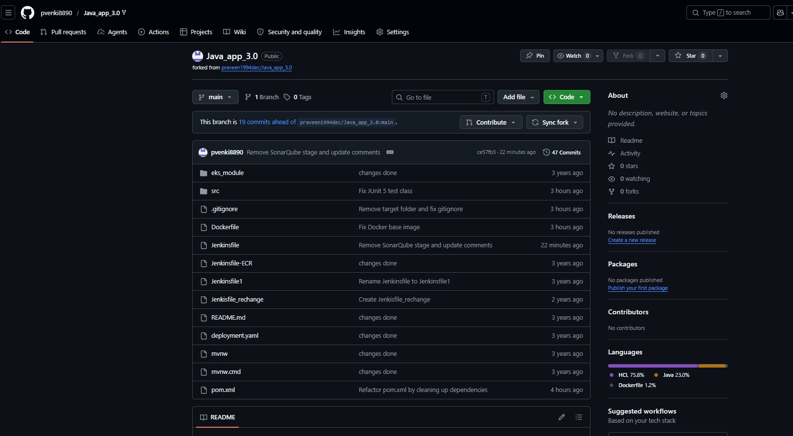
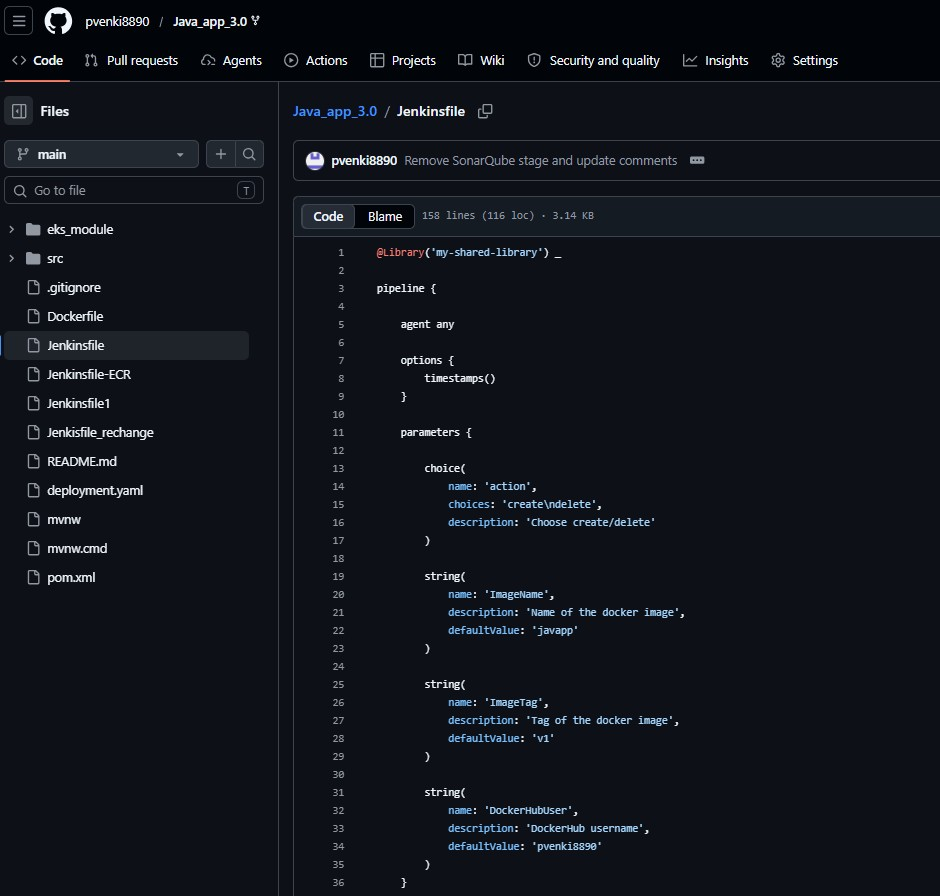
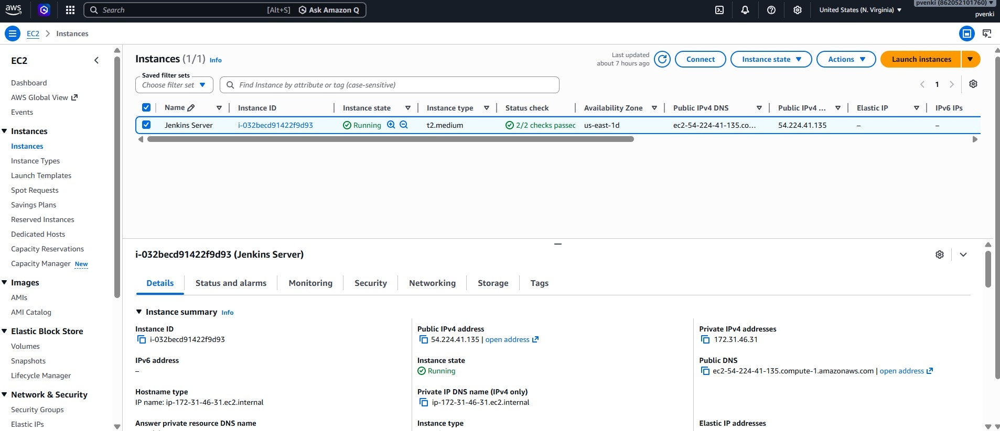
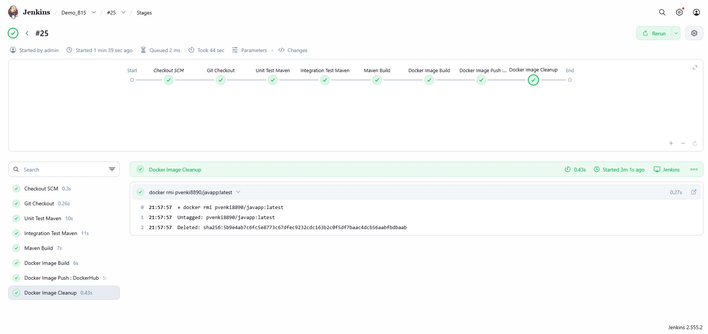
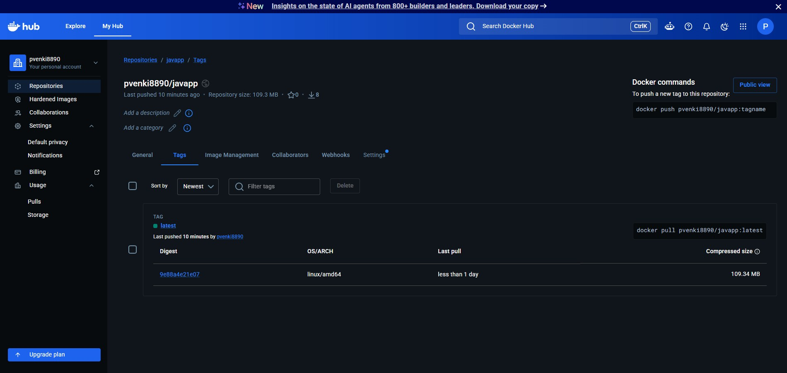

# 🚀 AWS Jenkins CI/CD Pipeline

Production-style CI/CD pipeline implemented on AWS EC2 using Jenkins, Maven, Docker, DockerHub, GitHub, and Jenkins Shared Libraries.

This project demonstrates the implementation of a modern Continuous Integration and Continuous Delivery (CI/CD) workflow for a Java Spring Boot application.

---

## 📌 Overview

The pipeline automates the following stages:

- Source Code Checkout
- Unit Testing
- Integration Testing
- Maven Build & Packaging
- Docker Image Build
- DockerHub Push
- Cleanup & Reporting

The complete solution was implemented and tested on AWS EC2 Ubuntu instances using Jenkins Pipeline as Code and Docker-based containerization.

---

## 🛠️ Technology Stack

| Category | Technologies |
|-----------|-------------|
| Cloud | AWS EC2 |
| CI/CD | Jenkins, Jenkins Shared Libraries |
| Build Tools | Maven, JUnit |
| Containerization | Docker, DockerHub |
| Source Control | Git, GitHub |
| Operating System | Ubuntu Linux |

---

## 📐 Architecture

```text
Developer
    │
    ▼
GitHub Repository
    │
    ▼
Jenkins Pipeline
    │
    ├── Git Checkout
    ├── Unit Testing
    ├── Integration Testing
    ├── Maven Build
    ├── Docker Build
    ├── DockerHub Push
    └── Cleanup
```

---

## 📷 Screenshots

### GitHub Repository Overview



### Jenkins Pipeline Code



### AWS EC2 Environment



### Successful Pipeline Execution



### DockerHub Published Image



---

## 📊 Key Outcomes

- Implemented Jenkins Pipeline as Code
- Automated build and testing workflows
- Containerized application using Docker
- Published Docker images to DockerHub
- Implemented Jenkins Shared Libraries
- Demonstrated CI/CD automation on AWS EC2

---

## 📂 Repository Structure

```text
AWS-Jenkins-DevSecOps-Pipeline
│
├── README.md
│
└── screenshots/
    ├── 01_github-repository-overview.jpg
    ├── 02_jenkinsfile-pipeline-code.jpg
    ├── 03_aws-ec2-environment.jpg
    ├── 05_successful-pipeline-run.jpg
    └── 07_dockerhub-image-published.jpg
```

---

## 🔗 Repositories

### CI/CD Pipeline Repository

https://github.com/pvenki8890/AWS-Jenkins-DevSecOps-Pipeline

### Application Repository

https://github.com/pvenki8890/Java_app_3.0

---

## 🚀 Future Enhancements

- SonarQube Integration
- Trivy Security Scanning
- JFrog Artifactory Integration
- Kubernetes Deployment
- Terraform Infrastructure Automation
- GitOps using ArgoCD
- Prometheus Monitoring
- Grafana Dashboards

---

## 👨‍💻 Author

**Papisetti Venkatesh**

Platform Engineer | DevOps Engineer | Site Reliability Engineer (SRE)

GitHub: https://github.com/pvenki8890

LinkedIn: https://www.linkedin.com/in/v-0b3699225/

---

⭐ If you found this project useful, consider giving it a star.
